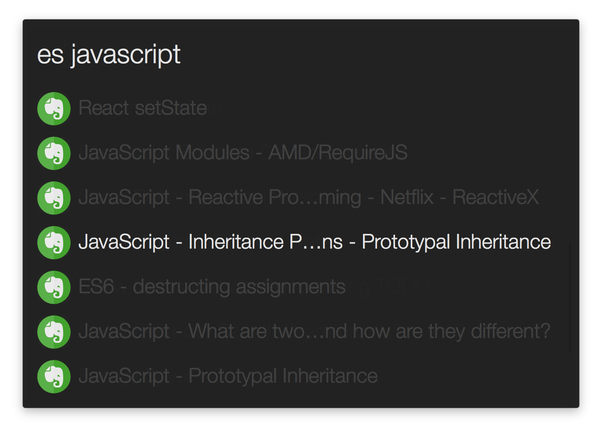
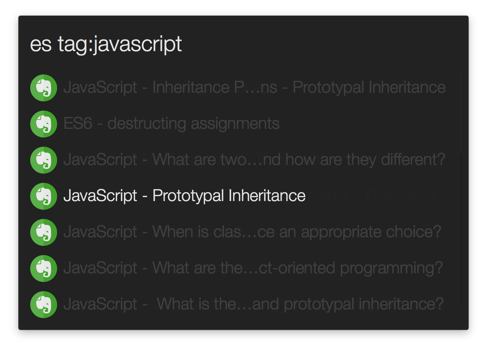
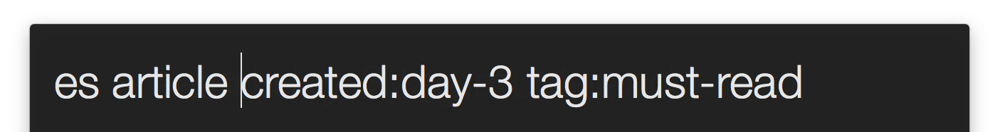

# Search Evernote - Alfred 2 workflow

This workflow uses Evernote's API (https://dev.evernote.com/doc/) to perform note search, which provides more relevant results, compare with the Desktop App. The workflow also supports all advanced search grammar that you can find here (https://dev.evernote.com/doc/articles/search_grammar.php). 

## Show Case

Search notes by words.

Search notes by tags.

Advanced Search Grammar (Show me notes that contains word `article` and are created within the last 3 days and are tagged with `must-read`) Checkout the complete search grammar here: https://dev.evernote.com/doc/articles/search_grammar.php

## Get Started

1. Download and Install the workflow. 
2. Run the `es-token` in Alfred app to setup your token.
3. Start searching with the `es` command (stands for Evernote Search)
4. Play with other built-in search shortcuts like `es-recent` and `es-todos`

## Customized Search Shortcut

Create your own search shortcut is simple. Open the `Evernote` workflow config in Alfred settings:

1. Copy/Paste a new trigger from the template `es-search-shortcut-template`
2. Open the new trigger and follow the instructions in Script
3. Done!

